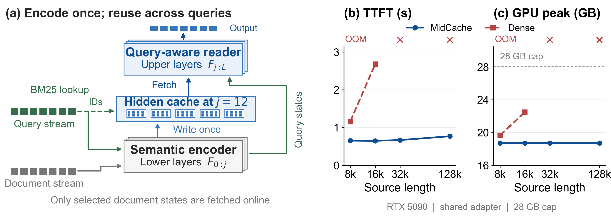

# MidCache

**Cache the Encoder Within: Reusing Intermediate Representations across LLM Queries**

**Reuse lower-layer document encoding through an intermediate residual cache.**

Early transformer layers act as a semantic encoder: their intermediate residuals
carry document information that later layers can read. MidCache makes that
computation reusable across queries by splitting a decoder into a lower encoder
and an upper reader. This is a functional interface, not a claim that all
understanding is completed at one universal layer.

**[Current paper (PDF)](paper_iclr2027/main.pdf)** ·
**[LaTeX and editable figures](paper_iclr2027/)** ·
**[Supplementary experiment scripts](exp/README.md)**



- **Write:** independently encode each document chunk through `layers[0:j]` and
  store one residual vector per token. A separate token-ID BM25 index addresses
  the stored chunks.
- **Read:** select chunks, assemble their cached states with the encoded sink
  and query, and continue through `layers[j:L]` with causal cross-chunk attention.
  A self-distilled suffix LoRA learns to consume the independently written states.
- **Generate:** each new output token still traverses **all layers**. Lower-layer
  request KV covers the query/generated prefix; upper-layer KV also covers the
  selected document pack. Only document residuals persist across requests.

With a fixed chunk budget, chunk size, and query length, model-side Read work is
bounded independently of stored source length. Write, storage, index construction,
and lookup still grow with the corpus. `j=0` replays selected raw tokens through
the full decoder and is the same-evidence depth reference; it is distinct from
full-source Dense without retrieval.

### Results and scope

The principal configuration uses Qwen3-8B, `j=12`, 512-token chunks, iterative
BM25 top-12, and rank-32 LoRA in blocks 12–35. The backbone is frozen.

The split follows the implementation's lower-third default: `round(0.33 * 36) = 12`.
This prepays 12 blocks and leaves 24 for Read. The separately distilled depth
sweep supports this operating point: `j=6/12/18` gives RULER
`98.29/96.07/55.41` and Read latency `830.3/664.4/499.5 ms`.
This is a practical quality/cost choice; the sweep does not establish a universal
optimum or a split selected on a held-out validation benchmark.

| Measurement | Result | What it establishes |
|---|---|---|
| Cross-benchmark MidCache accuracy | RULER 97.05; LongEval 69.0; LongBench 12.01; BABILong 50.43; LoCoMo 38.27 | Table 1's specified task/length support; the five-score mean is descriptive |
| Same-evidence, same-adapter H20 depth control | 1.403× selected-pack prefill speedup; RULER 99.19 → 96.07 | Saved lower-layer encoding with a 3.12-point quality cost on a separately sampled paired cohort |
| bf16 persistent payload | 8 KiB/token residual versus 144 KiB/token full-depth KV | 1/18 of KV payload storage, not a GPU-peak ratio |
| RTX 5090 full-source comparison, 28 GB cap | Dense OOM at 32k/128k; MidCache completes | End-to-end cost includes document preparation and 128 output tokens; OOMs have no numerical speedup |

Cache fidelity is task-dependent. The no-LoRA interface performs poorly on
several tasks; full-depth replay can remain preferable even with fewer selected
chunks. The paper separately reports overlap controls, both adapter settings for
chunk KV, full-vocabulary distillation diagnostics, clean-subset quality, and
preparation amortization. Large full-context speedups combine retrieval with
depth reuse and are not the matched depth-only result.

`paper_iclr2027/` contains the current manuscript with clickable numeric
citations and its aggregate plot/table inputs. `paper/` retains the ARR source.
Raw datasets, predictions, weights, private API responses, and execution logs
are not included in this repository.

## Install

```bash
pip install -r requirements.txt
# BABILong eval additionally needs the `babilong` package (pip install babilong).
```

Requires a local causal-LM checkpoint (Llama-3-8B, Qwen3-8B, or an in-tree MoE).

## Minimal use

The released Python interface is `comem.CoMem`; the paper refers to the method as MidCache.

```python
from transformers import AutoModelForCausalLM, AutoTokenizer
from comem import CoMem

tok = AutoTokenizer.from_pretrained(PATH)
lm  = AutoModelForCausalLM.from_pretrained(PATH, torch_dtype="bfloat16").cuda().eval()

model = CoMem(lm, resume_j=12, tokenizer=tok)   # split the backbone at layer 12
model.encode(long_document)                     # encode once → cache h_j per chunk
answer = model.generate("What is X?",           # retrieve topk → resume → decode
                        selector="iter_bm25", topk=12, max_new_tokens=32,
                        iter_hop_topk=4)
```

This minimal example loads the no-LoRA interface. To reproduce the principal
paper configuration, load its suffix adapter and use the explicit evaluation
settings below; the library's automatic selector routing is a separate option.

- `selector`: `auto` (**default for RULER — data-validated per-task routing**
  (8B RULER n=500): `variable_tracking` → **fixed `iter_bm25`** (multi-hop BFS on
  the literal VAR chain, `iter_hop_topk=4`), all `niah_*` → **`bm25`** (single-shot
  lexical). This replaces the old single universal `iter_bm25_adaptive` default,
  whose confidence early-stop collapsed the VT chain (31/25/22 vs `iter_bm25`
  97/97/98 on 8k/16k/32k) and hurt `niah_multikey` (91/70/32 vs `bm25` 91/91/92);
  pass an explicit `--selector` to override it on ALL tasks for controls), `bm25`
  (lexical), `reader_attn` (cosine over `h_j`), `iter_bm25` /
  `iter_reader_attn` (multi-hop BFS for reference chains, e.g. RULER variable
  tracking), `iter_bm25_adaptive` (confidence-adaptive `iter_bm25`: no fixed
  `topk` budget — walk the chain until a hop's best score drops below
  `--iter_conf_ratio`× the round-1 best or `--iter_max_chunks` is hit; **kept as
  an opt-in selector for ρ-tuning experiments, no longer the default**),
  `recency`, `oracle`, `dense_bge` (frozen BGE dense retrieval — CLS+L2+cosine
  over each chunk's decoded text; the single-variable "dense instead of lexical"
  arm, needs `--retriever_path`).
- `mode`: `comem` (retrieval, fixed read; default), `kvdirect` / `hcache`
  (no-retrieval baselines that pack **all** chunks — read grows O(context); build
  `CoMem(resume_j=0)` for a faithful `kvdirect`).
- Sharded MoE backbones: use `comem.CoMemMoE` / `comem.load_moe_comem`.

### Package layout

```
comem/
  model.py       # class CoMem: primitives (write/read/decode/resume) + encode/generate
  selectors.py   # bm25 / iter_bm25 / iter_bm25_adaptive / reader_attn / iter_reader_attn / recency / oracle / dense_bge
  moe.py         # CoMemMoE: device_map-sharded MoE variant
  cacheblend.py  # CacheBlend-style full-depth chunk-KV baseline (+ its own gate)
  kvcompress.py  # SnapKV / PyramidKV prefill-then-compress baselines (+ its own gate)
  selftest.py    # CPU correctness gate (python -m comem.selftest)
train/distill.py # LoRA self-distillation (teacher j=0 → student j) on PG19
eval/            # thin drivers: build CoMem + generate + official scoring
  ruler.py  babilong.py  longbench.py  locomo.py  longeval.py
bench/vs_dense.py# CoMem vs Dense speed/accuracy + decode correctness gate
paper_iclr2027/   # current PDF, LaTeX, figures, and aggregate measurements
paper/           # ARR LaTeX source
exp/             # supplementary quality and systems controls (see exp/README.md)
EXPERIMENTS.md   # experiment -> paper table -> CLI flag provenance index
```

## Correctness

`generate` is byte-identical to the reference research implementation.
`python -m comem.selftest` (CPU, tiny random Qwen3, fp32) checks:

- **(A)** `j=0` write/read packing == a stock `model(input_ids)` forward (diff `0`),
- **(B)** `resume_forward_ids` == full forward at several `j`,
- **(C)** `encode`+`generate` == the monolithic `generate_from_ids` for every
  selector (identical tokens),
- **(D)** KV-cache decode == recompute decode (identical tokens, max|logit diff|
  `< 1e-4`).
- **(E)** the baseline gates — CacheBlend (RoPE reindex exact, `r=1` == full
  prefill, `r=0` finite) and SnapKV/PyramidKV (no perturbation when no
  compression fires, retained-KV budget honoured). Run them alone with
  `python -m comem.cacheblend` / `python -m comem.kvcompress`.
- **(F)** the `dense_bge` selector's dispatch, tie-break and fail-closed guard
  (via an offline stub encoder, so no checkpoint is needed).

## Reproducing the eval

For the current manuscript, use explicit `--j 12`, `--selector iter_bm25`,
`--topk 12`, and the principal `--adapter` instead of automatic task routing.
Use `--adapter none` for MidCache without LoRA. The exact no-adapter remeasurement
and supplementary protocols are in [`exp/README.md`](exp/README.md); synthetic
cohorts and natural-task generation limits are specified in the paper appendix.

Each `eval/*.py` builds a `CoMem`, runs `generate_from_ids` per sample (the fused
encode+write+select+decode over one prompt whose trailing chunk is the query), and
applies the benchmark's **official** metric.

### One command, any cell

Every driver shares one unified CLI, so a single habit works everywhere:

```
--model <hf_path_or_name>   --j <int|auto>   --lengths 8k,16k,32k,64k,128k
--n <samples>   --selector bm25   --adapter <path|none>
--baseline <none|dense|kvdirect|hcache|streamingllm|snapkv|pyramidkv|cacheblend>
--out <dir>
# baseline-specific: --recompute_ratio (cacheblend) --kv_budget/--kv_window
#                    (snapkv/pyramidkv) --retriever_path (--selector dense_bge)
```

Run through the dispatcher (routes `--benchmark` to the matching driver):

```bash
python -m eval.run --benchmark ruler --model /path/to/Qwen3-8B --j auto \
    --lengths 8k,16k,32k --n 100 --selector bm25 --out ruler_results/qwen3_8b
```

…or the convenience wrapper (`--j auto` and env-override defaults):

```bash
./run_cell.sh ruler /path/to/Qwen3-8B --lengths 8k,16k,32k --n 100
# env overrides: PYTHON_BIN=..  J=12  BASELINE=dense  SELECTOR=reader_attn
```

The old native flags (`--model_path`, `--resume_j`, `--limit`/`--num_samples`/
`--max_samples`, `--output_dir`, space-separated lengths) still work as aliases.

### Model → split depth (`--j auto`)

`--j auto` picks the per-backbone split depth from `comem/model_registry.py`
(`resume_j ≈ round(0.33 · num_hidden_layers)`); unknown models fall back to that
formula with a warning.

| Model         | Layers L | `--j` |
|---------------|:--------:|:-----:|
| Qwen3-0.6B    | 28       | 9     |
| Qwen3-1.7B    | 28       | 9     |
| Qwen3-4B      | 36       | 12    |
| Qwen3-8B      | 36       | 12    |
| Qwen3-14B     | 40       | 13    |
| Qwen3-32B     | 64       | 21    |
| Qwen3-30B-A3B | 48       | 16    |

### One-line run per benchmark (copy-paste)

```bash
# RULER   (NIAH + variable-tracking; synthetic length sweep)
# --selector defaults to `auto` (per-task routing): vt -> fixed iter_bm25, niah_* -> bm25 (data-validated on 8B RULER n=500)
python -m eval.run --benchmark ruler --model /path/to/Qwen3-8B --j auto \
    --lengths 8k,16k,32k,64k,128k --n 100 --out ruler_results/qwen3_8b

# BABILong (qa1..qa10 x lengths; needs `pip install babilong`)
python -m eval.run --benchmark babilong --model /path/to/Llama-3-8B --j auto \
    --tasks qa1,qa2,qa5 --lengths 0k,1k,2k,4k,8k,16k --n 100 --out babilong_results/llama3_8b

# LongBench (real long-doc QA; per-dataset SQuAD F1/EM)
python -m eval.run --benchmark longbench --model /path/to/Qwen3-8B --j auto \
    --tasks narrativeqa,qasper,hotpotqa,2wikimqa,musique,multifieldqa_en \
    --out longbench_results/qwen3_8b

# LongEval (LongChat lines-retrieval; exact-value accuracy)
python -m eval.run --benchmark longeval --model /path/to/Qwen3-8B --j auto \
    --lengths 4k,8k,16k,32k,64k,128k --n 50 --out longeval_results/qwen3_8b

# LoCoMo (long-conversation memory QA; F1/EM/acc by category)
python -m eval.run --benchmark locomo --model /path/to/Qwen3-8B --j auto \
    --locomo_data data/locomo10.json --out locomo_results/qwen3_8b
```

`--lengths` applies to RULER / BABILong / LongEval (synthetic sweeps); LongBench
and LoCoMo iterate their fixed datasets and use `--tasks` / `--locomo_data`.

### Results & official scoring

| Benchmark | Output (`--out`)                     | Metric / scorer |
|-----------|--------------------------------------|-----------------|
| RULER     | `<out>/{task}_{len}.csv` + `_summary.json` | `string_match` recall (RULER `string_match_all`; ref strings as case-insensitive substrings) |
| BABILong  | `<out>/{task}_{len}_..._csv`         | official `babilong.metrics` — `TASK_LABELS` + `compare_answers` (**never** bare `re.search`) |
| LongBench | `<out>/{ds}_*.jsonl` + `scores.json` | SQuAD-style token-F1 / EM (`--score_only` merges shards) |
| LongEval  | `<out>/longeval_{len}.json` + `_summary.json` | exact-value match accuracy |
| LoCoMo    | `<out>/preds*.jsonl` + `scores.json` | F1 / EM / substring-acc (cat-5 = abstention-correct; `--score_only` merges shards) |

`eval/{longbench,longeval,locomo}.py` support `--score_only` to merge shards.
LoRA distillation: `train/distill.py` then eval with `--adapter <dir>`.

### Baselines (`--baseline`)

| `--baseline`               | What it is                                                                                                                                | Stored per token |
|----------------------------|-------------------------------------------------------------------------------------------------------------------------------------------|------------------|
| `none`                     | MidCache itself (retrieval + fixed read at `--j`)                                                                                             | one depth-`j` residual (8 KiB on Qwen3-8B) |
| `kvdirect` / `hcache`      | no-retrieval MidCache packs (**all** chunks; read grows O(context))                                                                            | — |
| `dense`                    | stock full-context generation                                                                                                              | — (full prefill each query) |
| `streamingllm`             | sink + sliding-window truncation, then dense                                                                                               | — |
| `snapkv` / `pyramidkv`     | prefill-then-compress KV: **full (exact) prefill**, then evict to `--kv_budget` retained tokens/layer and decode from it (`comem.kvcompress`) | bounded KV, but the whole prompt is still prefilled |
| `cacheblend`               | CacheBlend-style full-depth chunk KV: same selector/pack/sink as MidCache, but caches every layer's chunk K/V, reindexes RoPE and recomputes a `--recompute_ratio` slice (`comem.cacheblend`) | full `L`-layer KV (144 KiB on Qwen3-8B, 18× MidCache) |

`snapkv`/`pyramidkv` default to `--kv_budget 6657` = MidCache's read pack
(BOS 1 + top-12 × 512 + query ≤ 512), which makes the quality row an
equal-retained-token diagnostic. `cacheblend` does **not** compress storage — it
caches the same bytes as a full KV cache and wins only on prefill/TTFT, so report
its 144 KiB/token tier alongside any latency win.

```bash
# CacheBlend-style arm, single-variable vs CoMem (same selector/chunk/topk/sink)
python -m eval.run --benchmark ruler --model /path/to/Qwen3-8B --j auto \
    --baseline cacheblend --recompute_ratio 0.15 --selector iter_bm25 --topk 12 \
    --out ruler_results/cacheblend_r015

# equal-retained-budget compressed-KV arms
python -m eval.run --benchmark ruler --model /path/to/Qwen3-8B --j auto \
    --baseline snapkv --kv_budget 6657 --kv_window 32 --out ruler_results/snapkv

# dense-retrieval selector swap (CoMem reader unchanged; only the ranking differs)
python -m eval.run --benchmark ruler --model /path/to/Qwen3-8B --j auto \
    --selector dense_bge --retriever_path /path/to/bge-large-en-v1.5 --topk 12 \
    --out ruler_results/dense_bge
```

See `EXPERIMENTS.md` for which paper table each of these reproduces.

### Division of labor

Eval is a fixed pipeline; only *(model, j, benchmark, length, selector, baseline)*
vary. Suggested split: **one person owns one model column** (`--model X --j auto`)
and sweeps all five benchmarks × all baselines for it, e.g.

```bash
for B in ruler babilong longbench longeval locomo; do
  for BASE in none dense kvdirect hcache streamingllm; do
    ./run_cell.sh $B /path/to/Qwen3-8B --baseline $BASE --out results/qwen3_8b/$B/$BASE
  done
done
```
